# Race Results Repository - System Specification

## 1. Executive Summary

The Race Results Repository is a Spring Boot microservice that provides version-controlled storage and management for rowing regatta timing data. It manages two types of EMF-based documents (Start Lists and Race Results) that conform to the Timing Data Interchange schema, enabling multiple timers to collaborate in capturing accurate race results for staggered-start rowing regattas.

**Target Audience:** Developers building collaborative Timing Data Interchange-based applications requiring secure, offline-first, scalable access to versioned timing models.

**Primary Users:** Rowing regatta timers stationed at race course timing milestones.

---

## 2. System Overview

### 2.1 Purpose

Enable accurate and rapid sharing of rowing regatta race results through:
- Versioned persistence of EMF Timing Data Interchange models
- Concurrent access for multiple timers (3 per milestone: primary, first backup, second backup)
- Offline-first client synchronization
- Real-time change notifications

### 2.2 Technology Stack

| Component | Technology |
|-----------|-----------|
| Framework | Spring Boot |
| Build System | Maven |
| Database | MariaDB (multi-instance) or H2 (single-node/embedded) |
| Serialization | XMI, JSON |
| APIs | REST (HTTP), Hessian RPC |
| Authentication | JWT |
| Notifications | MQTT (client), Webhooks |
| Model Framework | Eclipse Modeling Framework (EMF) |

**Maven Coordinates:**
- GroupId: `org.rowtown`
- Package Prefix: `org.rowtown`

---

## 3. Architecture

### 3.1 System Context

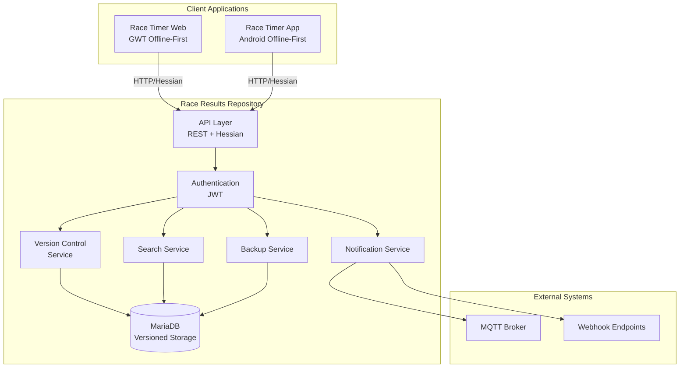

### 3.2 Component Architecture

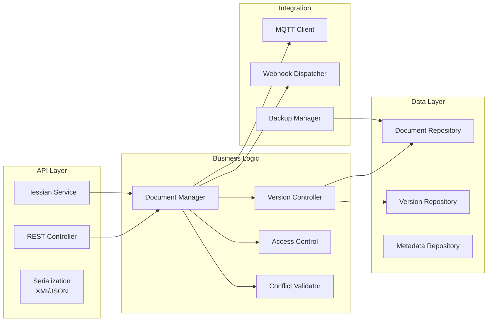

---

## 4. Domain Model

### 4.1 Document Types

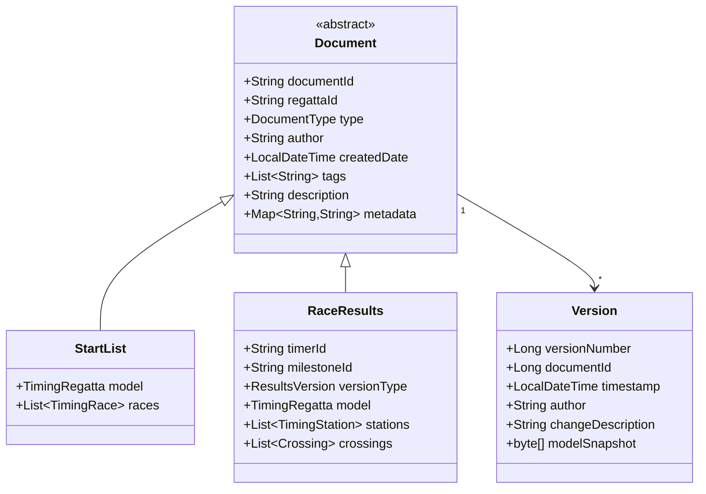

### 4.2 Key Relationships

**Per Regatta:**
- 1 Start List document
- N Race Results documents (1 per timer)

**Per Timing Milestone:**
- 3 timers capturing results
- Each timer produces 1 Race Results document with unique ResultsVersion (primary, firstBackup, secondBackup)

---

## 5. Functional Requirements

### 5.1 Document Management

#### 5.1.1 Create Document

**Input:**
- Document type (START_LIST, RACE_RESULTS)
- Regatta ID
- EMF model (TimingRegatta)
- Author
- Metadata (tags, description)

**Processing:**
1. Validate EMF model against Timing Data Interchange schema
2. Check authorization (regatta admin for Start List, timer for Race Results)
3. Create initial version (v1)
4. Store metadata
5. Trigger notification

**Output:**
- Document ID
- Version number

**Authorization:**
- Start List: regatta admin only
- Race Results: timer role with ownership

#### 5.1.2 Update Document

**Input:**
- Document ID
- Updated EMF model
- Change description

**Processing:**
1. Load current version
2. Validate ownership and permissions
3. Detect conflicts using EMF Compare
4. Create new version (auto-increment)
5. Store version snapshot
6. Trigger notification

**Output:**
- New version number
- Conflict warnings (if any)

**Conflict Validation:**
- Detect concurrent modifications
- Use optimistic locking
- Return conflict details for user resolution

#### 5.1.3 Retrieve Document

**Input:**
- Document ID
- Version number (optional, defaults to latest)
- Serialization format (XMI, JSON)

**Processing:**
1. Check read permission
2. Load specified version
3. Serialize EMF model

**Output:**
- Document metadata
- EMF model (XMI or JSON)
- Version information

### 5.2 Version Control

#### 5.2.1 Version Operations

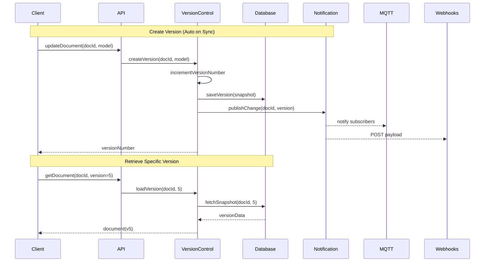

#### 5.2.2 List Version History

**Input:**
- Document ID
- Pagination (offset, limit)

**Output:**
- List of versions with:
  - Version number
  - Timestamp
  - Author
  - Change description
  - Size

#### 5.2.3 Compare Versions

**Input:**
- Document ID
- Source version number
- Target version number

**Processing:**
1. Load both version snapshots
2. Deserialize EMF models
3. Execute EMF Compare
4. Generate diff model

**Output:**
- EMF Compare Diff model showing:
  - Added elements
  - Removed elements
  - Changed elements
  - Field-level changes

#### 5.2.4 Rollback Version

**Input:**
- Document ID
- Target version number
- Rollback description

**Processing:**
1. Validate authorization (authorized user or regatta admin)
2. Load target version
3. Create new version with target content
4. Append rollback metadata
5. Trigger notification

**Output:**
- New version number
- Confirmation

**Authorization:**
- Regatta admin: can rollback any document
- Timer: can rollback own Race Results
- Viewer: no rollback permission

### 5.3 Search & Retrieval

#### 5.3.1 Search Criteria

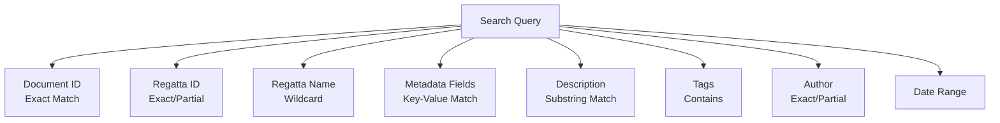

#### 5.3.2 Search Modes

| Mode | Syntax | Example |
|------|--------|---------|
| Exact | `field:value` | `regattaId:HEAD2025` |
| Partial | `field:*value*` | `regattaName:*Head*` |
| Wildcard | `field:val?e` | `author:john?` |
| Substring | `description:"race results"` | Case-insensitive `LIKE` on description |

#### 5.3.3 Search Response

**Output:**
- Paginated results
- Each result includes:
  - Document ID
  - Document type
  - Regatta ID/name
  - Latest version number
  - Metadata
  - Last modified timestamp

### 5.4 Security & Authorization

#### 5.4.1 Authentication

**Mechanism:** JWT (JSON Web Tokens)

**Token Contents:**
- User ID
- Username
- Roles
- Regatta permissions
- Expiration

**Flow:**
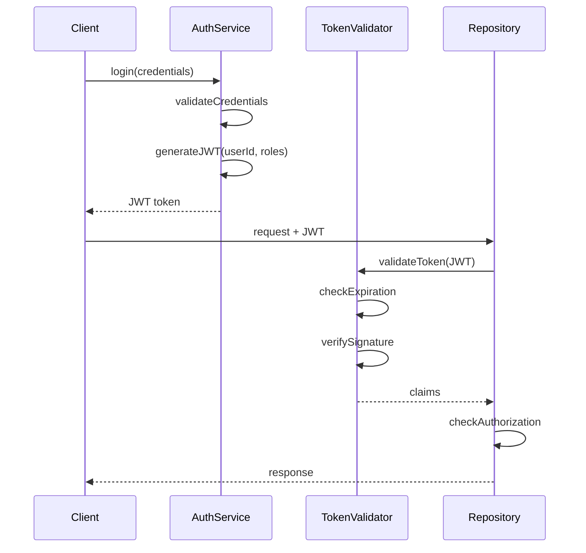

#### 5.4.2 Roles & Permissions

| Role | Permissions |
|------|-------------|
| **Regatta Admin** | Create/update/delete Start List<br/>Read all documents in regatta<br/>Rollback any document<br/>Manage ACLs<br/>Trigger backups |
| **Timer** | Create/update own Race Results<br/>Read Start List<br/>Read own Race Results<br/>Rollback own Race Results<br/>Subscribe to notifications |
| **Viewer** | Read Start List<br/>Read Race Results (if permitted)<br/>Subscribe to notifications |

#### 5.4.3 Access Control Lists (ACLs)

**Granularity:** Per regatta + per operation

**ACL Structure:**
```
Regatta: HEAD2025
├── START_LIST
│   ├── READ: [regatta_admin, timer, viewer]
│   ├── WRITE: [regatta_admin]
│   └── DELETE: [regatta_admin]
├── RACE_RESULTS
│   ├── READ: [regatta_admin, owner_timer]
│   ├── WRITE: [owner_timer]
│   └── DELETE: [regatta_admin]
```

**Operations:**
- CREATE
- READ
- UPDATE
- DELETE
- ROLLBACK
- SUBSCRIBE

**Access Levels:**
- READ_ONLY: Can retrieve documents
- READ_WRITE: Can retrieve and modify documents

#### 5.4.4 Ownership Rules

**Start List:**
- Owner: Regatta admin
- Modification: Regatta admin only
- Read: All roles

**Race Results:**
- Owner: Creating timer
- Modification: Owner timer only
- Read: Owner timer, regatta admin

### 5.5 Notifications

#### 5.5.1 MQTT Integration

**Architecture:**
- Service acts as MQTT client
- Connects to external MQTT broker
- Publishes change notifications

**Topic Structure:**
```
regatta/{regattaId}/startlist
regatta/{regattaId}/results/{timerId}
```

**Examples:**
```
regatta/HEAD2025/startlist
regatta/HEAD2025/results/timer001
regatta/HEAD2025/results/timer002
```

**Subscription Patterns:**
- Subscribe to specific document: `regatta/HEAD2025/startlist`
- Subscribe to all results in regatta: `regatta/HEAD2025/results/#`
- Subscribe to specific timer: `regatta/HEAD2025/results/timer001`

**Message Payload (JSON):**
```json
{
  "eventType": "VERSION_CREATED",
  "documentId": "doc-123",
  "documentType": "START_LIST",
  "regattaId": "HEAD2025",
  "versionNumber": 5,
  "timestamp": "2025-12-29T14:30:00Z",
  "author": "admin@rowtown.org",
  "changeDescription": "Updated race schedule",
  "changedFields": [
    "timingRace[2].scheduledTime",
    "timingRace[5].status"
  ]
}
```

**Event Types:**
- VERSION_CREATED
- DOCUMENT_CREATED
- FIELD_CHANGED
- DOCUMENT_DELETED

#### 5.5.2 Webhook Integration

**Mechanism:**
- HTTP POST to registered webhook URLs
- Includes full document in payload
- Retry on failure with exponential backoff

**Webhook Registration:**
```
POST /api/v1/webhooks/subscribe
{
  "documentId": "doc-123",
  "url": "https://client.example.com/webhook/results",
  "events": ["VERSION_CREATED", "FIELD_CHANGED"],
  "secret": "webhook-secret-key"
}
```

**Webhook Payload (JSON):**
```json
{
  "eventType": "VERSION_CREATED",
  "timestamp": "2025-12-29T14:30:00Z",
  "documentId": "doc-123",
  "versionNumber": 5,
  "document": {
    "metadata": { ... },
    "model": { ... }  // Full EMF model in JSON format
  },
  "signature": "HMAC-SHA256 signature"
}
```

**Retry Strategy:**
- Attempt 1: Immediate
- Attempt 2: 2 seconds delay
- Attempt 3: 4 seconds delay
- Attempt 4: 8 seconds delay
- Attempt 5: 16 seconds delay
- After 5 failures: Mark webhook as failed, notify admin

**Delivery Guarantees:**
- At-least-once delivery
- Idempotency keys in payload
- Signature validation using shared secret

#### 5.5.3 Notification Triggers

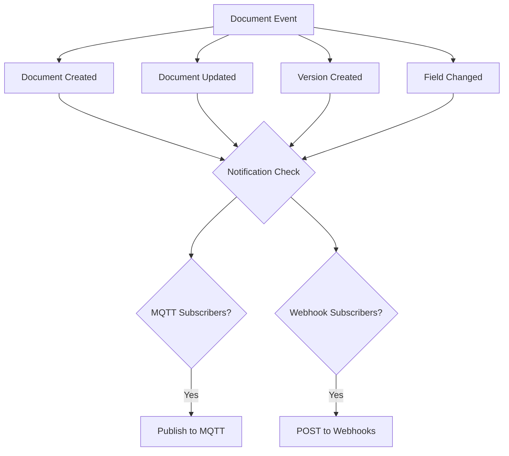

### 5.6 Backup & Restore

#### 5.6.1 Backup Types

**Full Backup:**
- All documents and all versions
- All metadata
- ACL configurations
- Subscription registrations

**Incremental Backup:**
- Changes since last backup
- New versions only
- Modified metadata
- Change-based detection

#### 5.6.2 Backup Schedule

**Automated:**
- Full backup: Daily at 2:00 AM
- Incremental backup: Every 4 hours

**On-Demand:**
- Triggered via API by regatta admin
- Pre-deployment backups
- Manual snapshots

#### 5.6.3 Backup Storage

**Location:** Local filesystem

**Structure:**
```
/backups/
├── full/
│   ├── backup-2025-12-29-020000/
│   │   ├── documents.sql
│   │   ├── versions.sql
│   │   ├── metadata.sql
│   │   └── manifest.json
├── incremental/
│   ├── backup-2025-12-29-060000/
│   │   ├── changes.sql
│   │   └── manifest.json
```

#### 5.6.4 Restore Operations

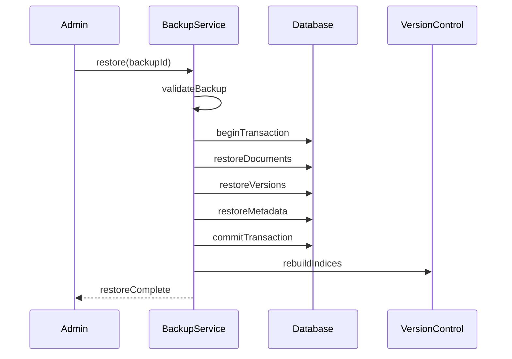

**Restore Modes:**
- **Full Restore:** Replace entire database
- **Selective Restore:** Restore specific regatta/document
- **Point-in-Time Restore:** Restore to specific backup timestamp

---

## 6. API Specifications

### 6.1 REST API

**Base URL:** `/api/v1`

**Serialization Formats:**
- XMI (XML Metadata Interchange)
- JSON

**Content Negotiation:**
- Request header: `Content-Type: application/xmi+xml` or `application/json`
- Response header: `Accept: application/xmi+xml` or `application/json`

#### 6.1.1 Document Endpoints

| Method | Endpoint | Description | Auth |
|--------|----------|-------------|------|
| POST | `/documents` | Create document | Timer, Admin |
| GET | `/documents/{id}` | Get latest version | All |
| GET | `/documents/{id}/versions/{version}` | Get specific version | All |
| PUT | `/documents/{id}` | Update document (creates new version) | Owner, Admin |
| DELETE | `/documents/{id}` | Delete document | Admin |
| GET | `/documents/search` | Search documents | All |

**Example: Create Document**
```
POST /api/v1/documents
Content-Type: application/json
Authorization: Bearer {JWT}

{
  "type": "RACE_RESULTS",
  "regattaId": "HEAD2025",
  "timerId": "timer001",
  "milestoneId": "finish",
  "versionType": "primary",
  "metadata": {
    "tags": ["preliminary"],
    "description": "Finish line primary results"
  },
  "model": {
    // EMF TimingRegatta model in JSON
  }
}

Response: 201 Created
{
  "documentId": "doc-456",
  "versionNumber": 1,
  "createdAt": "2025-12-29T14:30:00Z"
}
```

**Example: Update Document**
```
PUT /api/v1/documents/doc-456
Content-Type: application/json
Authorization: Bearer {JWT}

{
  "changeDescription": "Updated crossing times",
  "model": {
    // Updated EMF model
  }
}

Response: 200 OK
{
  "documentId": "doc-456",
  "versionNumber": 2,
  "updatedAt": "2025-12-29T14:35:00Z"
}
```

#### 6.1.2 Version Control Endpoints

| Method | Endpoint | Description | Auth |
|--------|----------|-------------|------|
| GET | `/documents/{id}/versions` | List version history | All |
| GET | `/documents/{id}/versions/{v1}/compare/{v2}` | Compare versions | All |
| POST | `/documents/{id}/rollback` | Rollback to version | Owner, Admin |

**Example: Compare Versions**
```
GET /api/v1/documents/doc-456/versions/1/compare/2
Authorization: Bearer {JWT}

Response: 200 OK
{
  "sourceVersion": 1,
  "targetVersion": 2,
  "diff": {
    // EMF Compare Diff model
    "changes": [
      {
        "type": "CHANGE",
        "element": "TimingStation[0].crossing[3]",
        "attribute": "timeCapture.time",
        "oldValue": 1735478100000,
        "newValue": 1735478105000
      }
    ]
  }
}
```

**Example: Rollback**
```
POST /api/v1/documents/doc-456/rollback
Authorization: Bearer {JWT}
Content-Type: application/json

{
  "targetVersion": 3,
  "description": "Rollback to correct timing data"
}

Response: 200 OK
{
  "documentId": "doc-456",
  "newVersionNumber": 5,
  "rolledBackTo": 3
}
```

#### 6.1.3 Search Endpoint

```
GET /api/v1/documents/search?regattaId=HEAD2025&type=RACE_RESULTS&tags=official
Authorization: Bearer {JWT}

Response: 200 OK
{
  "total": 15,
  "page": 1,
  "pageSize": 10,
  "results": [
    {
      "documentId": "doc-456",
      "type": "RACE_RESULTS",
      "regattaId": "HEAD2025",
      "timerId": "timer001",
      "latestVersion": 5,
      "lastModified": "2025-12-29T14:35:00Z",
      "metadata": { ... }
    }
  ]
}
```

#### 6.1.4 Notification Endpoints

| Method | Endpoint | Description | Auth |
|--------|----------|-------------|------|
| POST | `/webhooks/subscribe` | Register webhook | All |
| DELETE | `/webhooks/{id}` | Unregister webhook | Owner |
| GET | `/webhooks` | List webhooks | Owner |
| POST | `/mqtt/subscribe` | Get MQTT subscription info | All |

#### 6.1.5 Backup Endpoints

| Method | Endpoint | Description | Auth |
|--------|----------|-------------|------|
| POST | `/backups/full` | Trigger full backup | Admin |
| POST | `/backups/incremental` | Trigger incremental backup | Admin |
| GET | `/backups` | List available backups | Admin |
| POST | `/backups/{id}/restore` | Restore from backup | Admin |

#### 6.1.6 Rate Limiting

**Default Limits:**
- Read operations: 100 requests/minute per user
- Write operations: 20 requests/minute per user
- Search operations: 30 requests/minute per user

**Headers:**
```
X-RateLimit-Limit: 100
X-RateLimit-Remaining: 87
X-RateLimit-Reset: 1735478400
```

**Exceeded Response:**
```
HTTP 429 Too Many Requests
Retry-After: 45

{
  "error": "Rate limit exceeded",
  "retryAfter": 45
}
```

### 6.2 Hessian RPC API

**Endpoint:** `/hessian/repository`

**Protocol:** Hessian Binary Web Service Protocol

**Interface Definition (Pseudo-code):**
```
interface RepositoryService {
  // Document operations
  String createDocument(DocumentRequest request)
  Document getDocument(String documentId, Integer version)
  Integer updateDocument(String documentId, UpdateRequest request)
  void deleteDocument(String documentId)

  // Version control
  List<VersionInfo> listVersions(String documentId, Pagination page)
  DiffModel compareVersions(String documentId, int v1, int v2)
  Integer rollback(String documentId, int targetVersion, String description)

  // Search
  SearchResults search(SearchQuery query)

  // Notifications
  String subscribeWebhook(WebhookSubscription subscription)
  void unsubscribeWebhook(String subscriptionId)
  MqttConnectionInfo getMqttInfo()

  // Backup (admin only)
  String triggerBackup(BackupType type)
  List<BackupInfo> listBackups()
  void restoreBackup(String backupId, RestoreOptions options)
}
```

**Client Usage Example (Pseudo-code):**
```
HessianProxyFactory factory = new HessianProxyFactory()
factory.setOverloadEnabled(true)

RepositoryService service = factory.create(
  RepositoryService.class,
  "https://repository.example.com/hessian/repository"
)

// Add JWT to request headers
factory.addHeader("Authorization", "Bearer " + jwtToken)

// Create document
Document doc = service.createDocument(request)

// Get document with specific version
Document v3 = service.getDocument("doc-456", 3)
```

**Feature Parity:**
- All REST API operations available via Hessian
- Same authentication (JWT in headers)
- Same authorization rules
- Same rate limiting

---

## 7. Data Model & Storage

### 7.1 Database Schema

#### 7.1.1 Core Tables

**documents**
```
document_id         BIGINT PRIMARY KEY AUTO_INCREMENT
document_type       ENUM('START_LIST', 'RACE_RESULTS')   -- single-table inheritance discriminator
regatta_id          VARCHAR(255) NOT NULL   -- regatta name
regatta_start_date  DATE NOT NULL           -- regattas are periodic; name + start date identify a regatta
race_id             VARCHAR(255) NULL       -- Race Results only; derived from the model
milestone_id        VARCHAR(255) NULL       -- Race Results only
timer_role          VARCHAR(20)  NULL       -- Race Results only: PRIMARY | FIRST_BACKUP | SECOND_BACKUP
author              VARCHAR(255) NOT NULL
created_at          TIMESTAMP DEFAULT CURRENT_TIMESTAMP
latest_version      BIGINT NOT NULL DEFAULT 1
INDEX idx_regatta   (regatta_id)
INDEX idx_race      (race_id)
INDEX idx_type      (document_type)
```

The document table uses single-table inheritance: a Start List
(`StartListDocument`) has only the shared columns, while Race Results
(`RaceResultsDocument`) additionally use `race_id`, `milestone_id`, and
`timer_role`. A regatta has one Start List and many Race Results — one per
(race, milestone, timer). The Race Results key is
(regatta_id, regatta_start_date, race_id, milestone_id, timer_role).

**versions**
```
version_id          BIGINT PRIMARY KEY AUTO_INCREMENT
document_id         BIGINT NOT NULL
version_number      BIGINT NOT NULL
timestamp           TIMESTAMP DEFAULT CURRENT_TIMESTAMP
author              VARCHAR(255) NOT NULL
change_description  TEXT
model_snapshot      LONGBLOB NOT NULL
snapshot_format     ENUM('XMI', 'JSON')
checksum            VARCHAR(64)
FOREIGN KEY         (document_id) REFERENCES documents(document_id)
UNIQUE KEY          (document_id, version_number)
INDEX idx_timestamp (timestamp)
```

**metadata**
```
metadata_id         BIGINT PRIMARY KEY AUTO_INCREMENT
document_id         BIGINT NOT NULL
meta_key            VARCHAR(255) NOT NULL
meta_value          TEXT
FOREIGN KEY         (document_id) REFERENCES documents(document_id)
INDEX idx_key_value (meta_key, meta_value(255))
```

**tags**
```
tag_id              BIGINT PRIMARY KEY AUTO_INCREMENT
document_id         BIGINT NOT NULL
tag_name            VARCHAR(100) NOT NULL
FOREIGN KEY         (document_id) REFERENCES documents(document_id)
INDEX idx_tag       (tag_name)
```

#### 7.1.2 Authorization Tables

**acl_entries**
```
acl_id              BIGINT PRIMARY KEY AUTO_INCREMENT
regatta_id          VARCHAR(255) NOT NULL
resource_type       ENUM('START_LIST', 'RACE_RESULTS')
operation           ENUM('CREATE', 'READ', 'UPDATE', 'DELETE', 'ROLLBACK', 'SUBSCRIBE')
role                ENUM('regatta_admin', 'timer', 'viewer')
allowed             BOOLEAN DEFAULT TRUE
INDEX idx_regatta   (regatta_id)
```

**document_ownership**
```
ownership_id        BIGINT PRIMARY KEY AUTO_INCREMENT
document_id         BIGINT NOT NULL
owner_user_id       VARCHAR(255) NOT NULL
FOREIGN KEY         (document_id) REFERENCES documents(document_id)
INDEX idx_owner     (owner_user_id)
```

#### 7.1.3 Notification Tables

**webhook_subscriptions**
```
subscription_id     BIGINT PRIMARY KEY AUTO_INCREMENT
document_id         BIGINT NULL
regatta_id          VARCHAR(255) NULL
webhook_url         VARCHAR(1024) NOT NULL
secret_key          VARCHAR(255) NOT NULL
events              JSON
created_at          TIMESTAMP DEFAULT CURRENT_TIMESTAMP
active              BOOLEAN DEFAULT TRUE
failed_deliveries   INT DEFAULT 0
last_failure        TIMESTAMP NULL
INDEX idx_document  (document_id)
INDEX idx_regatta   (regatta_id)
```

**mqtt_subscriptions**
```
subscription_id     BIGINT PRIMARY KEY AUTO_INCREMENT
user_id             VARCHAR(255) NOT NULL
topic_pattern       VARCHAR(512) NOT NULL
created_at          TIMESTAMP DEFAULT CURRENT_TIMESTAMP
active              BOOLEAN DEFAULT TRUE
INDEX idx_user      (user_id)
```

#### 7.1.4 Multi-Database Support

The schema above is conceptual. The actual schema is maintained as **per-vendor
Flyway migrations** so the application runs on either database:

- `src/main/resources/db/migration/mariadb/` — MariaDB (InnoDB, utf8mb4,
  `LONGBLOB`, prefix indexes) for multi-instance deployments.
- `src/main/resources/db/migration/h2/` — native H2 (`BLOB`, `VARCHAR`,
  standalone `CREATE INDEX`) for single-node / embedded deployments.

Flyway's `{vendor}` placeholder (`classpath:db/migration/{vendor}`) selects the
correct set from the JDBC connection, and Hibernate runs with `ddl-auto=validate`
against it. Entity `@Column` names are used verbatim as physical column names
(`PhysicalNamingStrategyStandardImpl`), so both migration sets must match the
entity column names exactly. A CI matrix runs the suite against both engines to
catch drift. See `docs/h2-production-support.md`.

### 7.2 Version Storage Strategy

**Application-Level Versioning:**
1. Store full model snapshot for each version
2. Use a large binary column for EMF model storage (`LONGBLOB` on MariaDB, `BLOB` on H2)
3. Support both XMI and JSON serialization
4. Calculate checksum for integrity verification

**Version Creation Flow:**
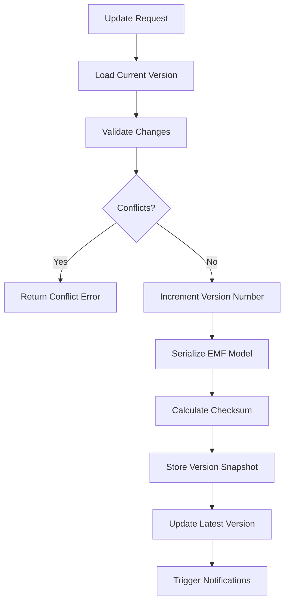

### 7.3 Description Search Implementation

**Strategy:** Portable case-insensitive substring matching (`LIKE`), so search
behaves identically on MariaDB and H2. (Engine-specific full-text indexing, e.g.
MariaDB `FULLTEXT` / `MATCH ... AGAINST`, is intentionally avoided so the query
layer stays database-agnostic; it could be added later behind a vendor-specific
strategy if ranking/relevance is required.)

**Searchable Fields:**
- Document description
- Metadata values
- Regatta name/ID
- Tags

**Search Query Processing (JPQL, portable):**
```sql
SELECT d.* FROM documents d
LEFT JOIN metadata m ON d.document_id = m.document_id
WHERE
  LOWER(d.description) LIKE LOWER('%race results%')
  OR LOWER(m.meta_value) LIKE LOWER('%race%')
```

---

## 8. Performance Requirements

### 8.1 Response Time Targets

| Operation Type | Target | Acceptable |
|----------------|--------|------------|
| Read (single document) | <100ms | <200ms |
| Read (latest version) | <50ms | <100ms |
| Write (create version) | <300ms | <500ms |
| Search (paginated) | <200ms | <400ms |
| Version comparison | <500ms | <1000ms |
| Rollback | <400ms | <800ms |

### 8.2 Throughput

**Concurrent Users:**
- 50 concurrent timers per regatta
- 150 total concurrent users (3 regattas)

**Operations per Second:**
- Reads: 500 ops/sec
- Writes: 100 ops/sec
- Searches: 50 ops/sec

### 8.3 Scalability

**Data Volume:**
- 100 regattas per year
- 200 races per regatta
- 50 versions per document average
- 5-year retention
- Estimated: ~500GB storage

**Optimization Strategies:**
- Database connection pooling
- Result caching (Redis)
- Asynchronous notification dispatch
- Batch version retrieval
- Lazy EMF model loading

---

## 9. Deployment Options

### 9.1 Standalone Deployment

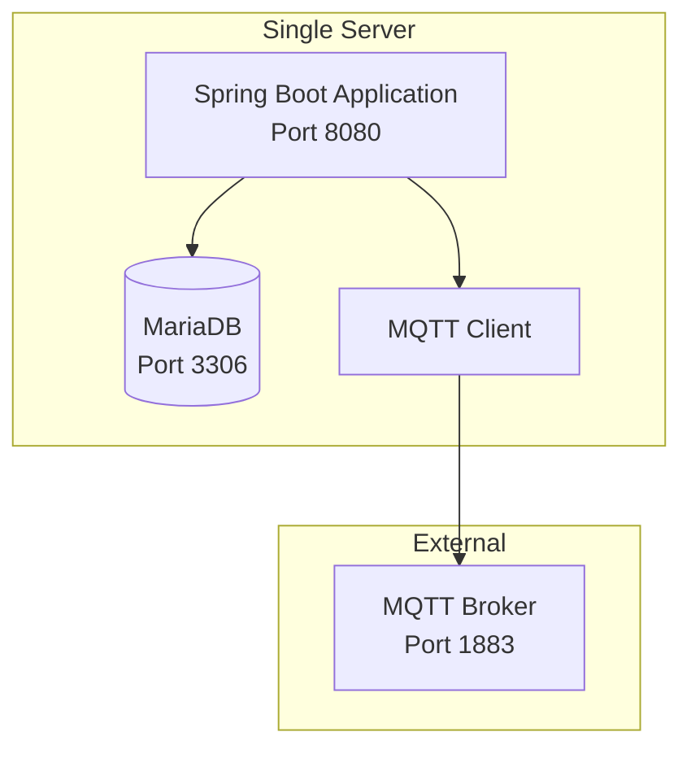

**Requirements:**
- Java 17 or higher
- MariaDB 10.6+
- 4GB RAM minimum
- 100GB storage minimum

**Configuration:**
```
application.properties:
  server.port=8080
  spring.datasource.url=jdbc:mariadb://localhost:3306/race_results
  mqtt.broker.url=tcp://localhost:1883
  backup.directory=/var/backups/race-results
```

**Startup:**
```bash
java -jar race-results-repository.jar
```

### 9.2 Docker Deployment

**Dockerfile Structure:**
```dockerfile
FROM eclipse-temurin:17-jre-alpine
WORKDIR /app
COPY target/race-results-repository.jar app.jar
EXPOSE 8080
ENTRYPOINT ["java", "-jar", "app.jar"]
```

**Docker Compose:**
```yaml
services:
  repository:
    image: org.rowtown/race-results-repository:latest
    ports:
      - "8080:8080"
    environment:
      - SPRING_DATASOURCE_URL=jdbc:mariadb://db:3306/race_results
      - MQTT_BROKER_URL=tcp://mosquitto:1883
    volumes:
      - backup-data:/backups
    depends_on:
      - db
      - mosquitto

  db:
    image: mariadb:10.6
    environment:
      - MYSQL_ROOT_PASSWORD=secret
      - MYSQL_DATABASE=race_results
    volumes:
      - db-data:/var/lib/mysql

  mosquitto:
    image: eclipse-mosquitto:latest
    ports:
      - "1883:1883"
```

### 9.3 Kubernetes Deployment

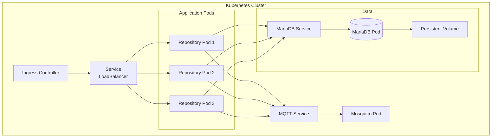

**Key Manifests:**

**Deployment:**
```yaml
apiVersion: apps/v1
kind: Deployment
metadata:
  name: race-results-repository
spec:
  replicas: 3
  selector:
    matchLabels:
      app: race-results-repository
  template:
    metadata:
      labels:
        app: race-results-repository
    spec:
      containers:
      - name: repository
        image: org.rowtown/race-results-repository:1.0.0
        ports:
        - containerPort: 8080
        env:
        - name: SPRING_DATASOURCE_URL
          valueFrom:
            configMapKeyRef:
              name: repository-config
              key: database.url
        resources:
          requests:
            memory: "2Gi"
            cpu: "1000m"
          limits:
            memory: "4Gi"
            cpu: "2000m"
```

**StatefulSet for MariaDB:**
```yaml
apiVersion: apps/v1
kind: StatefulSet
metadata:
  name: mariadb
spec:
  serviceName: mariadb
  replicas: 1
  selector:
    matchLabels:
      app: mariadb
  template:
    spec:
      containers:
      - name: mariadb
        image: mariadb:10.6
        volumeMounts:
        - name: data
          mountPath: /var/lib/mysql
  volumeClaimTemplates:
  - metadata:
      name: data
    spec:
      accessModes: ["ReadWriteOnce"]
      resources:
        requests:
          storage: 500Gi
```

**Resource Requirements:**
- CPU: 1 core per pod (3 pods = 3 cores)
- Memory: 2GB per pod (3 pods = 6GB)
- Storage: 500GB persistent volume
- Network: Load balancer

---

## 10. Implementation Steps Plan

### Phase 1: Foundation & Core Infrastructure (Weeks 1-2)

**Step 1.1: Project Setup**
- Initialize Maven project with Spring Boot
- Configure dependencies: Spring Web, Spring Data JPA, EMF, Hessian
- Set up project structure with org.rowtown package prefix
- Configure MariaDB connection
- Create application.properties templates

**Step 1.2: Domain Model Implementation**
- Import Timing Data Interchange EMF ecore schema
- Generate EMF model classes
- Create Document entity (abstract base)
- Create StartList and RaceResults entities
- Create Version entity
- Implement metadata and tag entities

**Step 1.3: Database Layer**
- Design and create database schema
- Implement JPA repositories:
  - DocumentRepository
  - VersionRepository
  - MetadataRepository
  - TagRepository
- Configure database connection pooling
- Create database migration scripts (Flyway/Liquibase)

### Phase 2: Version Control & Document Management (Weeks 3-4)

**Step 2.1: Version Control Service**
- Implement VersionControlService:
  - createVersion() with auto-increment
  - retrieveVersion() with lazy loading
  - listVersionHistory() with pagination
  - compareVersions() using EMF Compare
  - rollbackVersion() with authorization
- Implement version snapshot serialization (XMI/JSON)
- Add checksum calculation for integrity
- Create optimistic locking mechanism

**Step 2.2: Document Manager Service**
- Implement DocumentManagerService:
  - createDocument() with validation
  - updateDocument() with conflict detection
  - retrieveDocument() with version support
  - deleteDocument() with authorization
- Integrate EMF model validation
- Implement conflict detection logic
- Add transaction management

**Step 2.3: EMF Compare Integration**
- Configure EMF Compare dependencies
- Implement model comparison logic
- Create diff model serialization
- Add field-level change tracking

### Phase 3: Security & Authorization (Week 5)

**Step 3.1: Authentication**
- Configure Spring Security
- Implement JWT authentication:
  - Token generation
  - Token validation
  - Token refresh
- Create authentication filters
- Configure CORS policies

**Step 3.2: Authorization & ACLs**
- Implement role-based access control:
  - Regatta admin role
  - Timer role
  - Viewer role
- Create ACL service with per-regatta granularity
- Implement ownership validation
- Add method-level security annotations
- Create permission evaluators

**Step 3.3: Rate Limiting**
- Implement rate limiting filters
- Configure limits per role and operation type
- Add rate limit headers to responses
- Create rate limit exceeded handlers

### Phase 4: Search & Retrieval (Week 6)

**Step 4.1: Search Service**
- Implement SearchService with:
  - Exact match queries
  - Partial match queries
  - Wildcard support
  - Case-insensitive substring (`LIKE`) search on descriptions (portable across databases)
- Create search query builder
- Add pagination support

**Step 4.2: Search Optimization**
- Implement result caching
- Add database query optimization
- Create composite indices
- Add search result ranking

### Phase 5: REST API (Week 7)

**Step 5.1: REST Controllers**
- Implement DocumentController:
  - POST /documents
  - GET /documents/{id}
  - PUT /documents/{id}
  - DELETE /documents/{id}
- Implement VersionController:
  - GET /documents/{id}/versions
  - GET /documents/{id}/versions/{v1}/compare/{v2}
  - POST /documents/{id}/rollback
- Implement SearchController:
  - GET /documents/search

**Step 5.2: Serialization**
- Configure content negotiation
- Implement XMI serialization handler
- Implement JSON serialization handler
- Add format validation
- Create error response handlers

**Step 5.3: API Documentation**
- Configure OpenAPI/Swagger
- Document all endpoints
- Add request/response examples
- Create API usage guide

### Phase 6: Hessian RPC API (Week 8)

**Step 6.1: Hessian Service Interface**
- Define RepositoryService interface
- Implement service methods matching REST API
- Configure Hessian servlet
- Add JWT authentication to Hessian

**Step 6.2: Hessian Testing**
- Create Hessian client for testing
- Verify feature parity with REST API
- Test serialization/deserialization
- Validate performance

### Phase 7: Notifications - MQTT (Week 9)

**Step 7.1: MQTT Client Integration**
- Configure Spring MQTT dependencies
- Implement MQTT client service
- Create connection management
- Add reconnection logic

**Step 7.2: MQTT Publishing**
- Implement topic structure: regatta/{regattaId}/startlist, regatta/{regattaId}/results/{timerId}
- Create notification message builder
- Implement event-to-MQTT publisher
- Add publish confirmation handling

**Step 7.3: MQTT Subscription Management**
- Create subscription registry
- Implement subscription API endpoint
- Add subscription validation
- Create subscription information service

### Phase 8: Notifications - Webhooks (Week 10)

**Step 8.1: Webhook Service**
- Implement WebhookService:
  - registerWebhook()
  - unregisterWebhook()
  - listWebhooks()
- Create webhook subscription repository
- Add HMAC signature generation
- Implement webhook validation

**Step 8.2: Webhook Delivery**
- Implement webhook dispatcher with:
  - Asynchronous delivery
  - Exponential backoff retry (2s, 4s, 8s, 16s)
  - Failure tracking
  - Dead letter queue for failed deliveries
- Create full document payload builder
- Add delivery status monitoring

**Step 8.3: Webhook Security**
- Implement signature validation
- Add SSL/TLS verification
- Create webhook secret management
- Implement idempotency keys

### Phase 9: Backup & Restore (Week 11)

**Step 9.1: Backup Service**
- Implement BackupService:
  - triggerFullBackup()
  - triggerIncrementalBackup()
  - listBackups()
- Create backup manifest generator
- Implement filesystem storage
- Add backup compression

**Step 9.2: Automated Backup**
- Configure scheduled tasks:
  - Daily full backup at 2:00 AM
  - Incremental backup every 4 hours
- Implement backup retention policy
- Add backup verification
- Create backup monitoring alerts

**Step 9.3: Restore Service**
- Implement RestoreService:
  - restoreFull()
  - restoreSelective()
  - restorePointInTime()
- Create restore validation
- Add rollback for failed restores
- Implement restore progress tracking

### Phase 10: Integration & Testing (Week 12)

**Step 10.1: Unit Testing**
- Write unit tests for all services
- Create mock EMF models for testing
- Test version control operations
- Test authorization logic
- Achieve 80%+ code coverage

**Step 10.2: Integration Testing**
- Create end-to-end test scenarios:
  - Timer workflow (create, update, sync)
  - Admin workflow (manage Start List)
  - Multi-timer collaboration
- Test notification delivery
- Test backup/restore operations
- Validate API contract compliance

**Step 10.3: Performance Testing**
- Conduct load testing:
  - 50 concurrent timers
  - 500 reads/sec
  - 100 writes/sec
- Measure response times
- Identify bottlenecks
- Optimize database queries
- Tune JVM settings

### Phase 11: Deployment Preparation (Week 13)

**Step 11.1: Docker Packaging**
- Create optimized Dockerfile
- Build Docker image
- Create Docker Compose configuration
- Test Docker deployment
- Document Docker setup

**Step 11.2: Kubernetes Configuration**
- Create Deployment manifests
- Configure StatefulSet for MariaDB
- Set up Services and Ingress
- Create ConfigMaps and Secrets
- Document Kubernetes deployment

**Step 11.3: Standalone Packaging**
- Build executable JAR
- Create startup scripts
- Document system requirements
- Create installation guide
- Package dependencies

### Phase 12: Documentation & Finalization (Week 14)

**Step 12.1: Technical Documentation**
- Create architecture documentation
- Document API specifications
- Write deployment guides
- Create troubleshooting guide
- Document configuration options

**Step 12.2: User Documentation**
- Create user guides for:
  - Regatta administrators
  - Race timers
  - API consumers
- Write integration examples
- Document best practices
- Create FAQ

**Step 12.3: Operational Readiness**
- Create monitoring dashboards
- Configure logging and alerting
- Set up health check endpoints
- Create runbooks for operations
- Conduct security review

---

## Appendix A: Glossary

| Term | Definition |
|------|------------|
| **EMF** | Eclipse Modeling Framework - a Java framework for building tools based on structured data models |
| **Timing Data Interchange** | EMF-based schema for representing rowing race timing information |
| **Start List** | Chronologically ordered schedule of races and crew assignments (read-only for timers) |
| **Race Results** | Timing data captured by timers including crossing times and crew identifications |
| **Staggered Start** | Racing format where crews start at different times based on handicaps |
| **Timing Milestone** | Specific point on race course where times are captured (start, midcourse, finish) |
| **Results Version** | Redundant timing capture: primary, first backup, second backup |
| **XMI** | XML Metadata Interchange - standard XML serialization format for EMF models |
| **Regatta** | Rowing competition event consisting of multiple races |
| **Bow/Lane Number** | Crew identifier used by timers to record crossing times |
| **Crossing** | Event when a crew passes a timing milestone |

---

## Appendix B: Key Design Decisions

1. **Application-Level Versioning:** Chosen over database-level to provide full model snapshots and simplified comparison using EMF Compare.

2. **Dual API Support:** Both REST and Hessian to accommodate different client preferences (REST for web/mobile, Hessian for Java-to-Java efficiency).

3. **MQTT Client Architecture:** Service acts as publisher to external broker rather than hosting broker, reducing operational complexity.

4. **Full Document in Webhooks:** Provides complete context to subscribers, simplifying client implementation at cost of bandwidth.

5. **Database Choice:** MariaDB is the default for multi-instance deployments (proven scalability for this data volume). H2 is supported for single-node/embedded installs via per-vendor Flyway migrations; the query layer stays database-agnostic (portable `LIKE` search rather than engine-specific full-text indexing).

6. **Local Filesystem Backups:** Simplifies initial deployment; can be extended to cloud storage in future iterations.

7. **Optimistic Locking:** Preferred over pessimistic to support offline-first client synchronization model.

8. **Auto-Versioning on Sync:** Ensures complete audit trail without requiring explicit version creation by timers.

---

**Document Version:** 1.0
**Last Updated:** 2025-12-29
**Author:** Race Results Repository Specification Team
